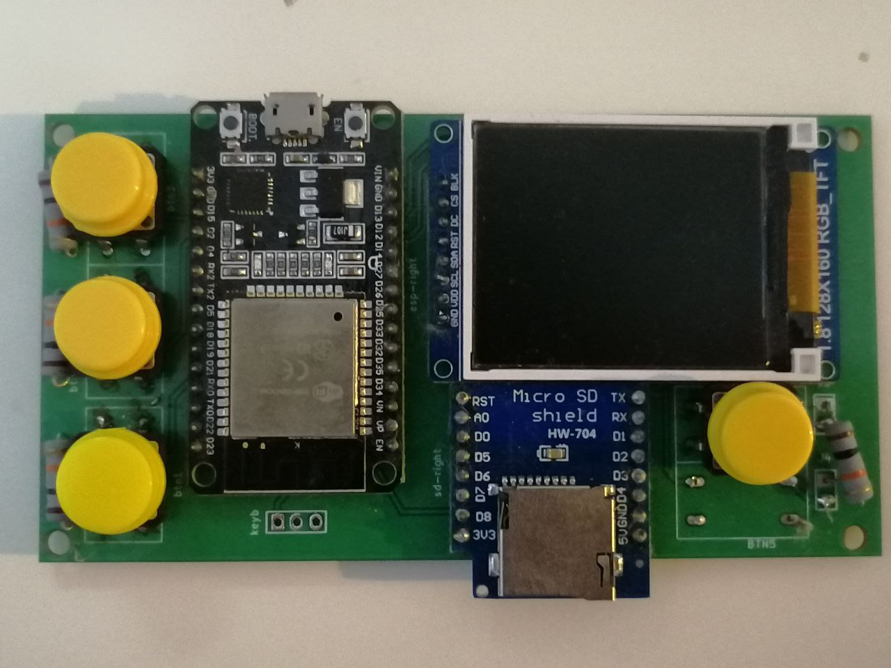
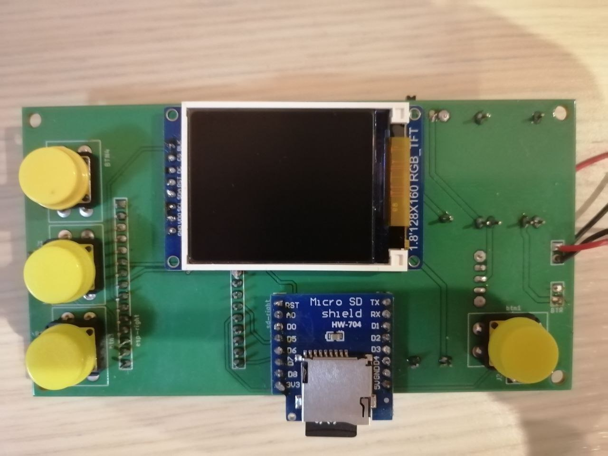
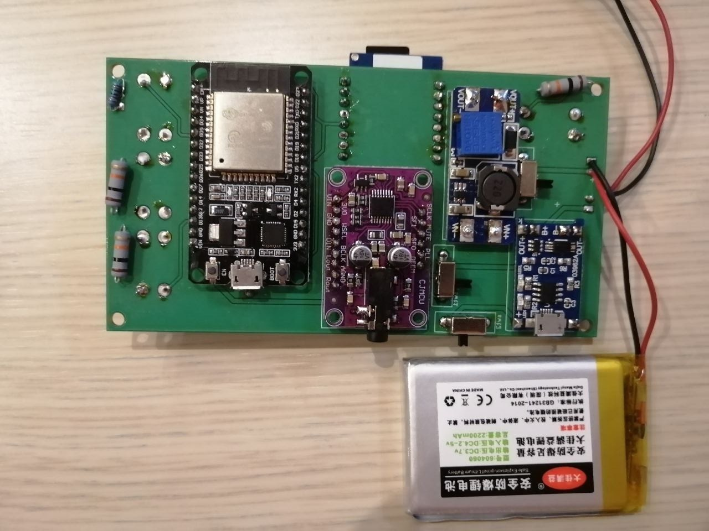

# Book In Pocket

ESP32 based book reader + mp3 player

 
 

## Parts: 
- DOIT Esp32 DevKit v1 (ESP-WROOM-32 DevKit v1)
- OLED Monochrome SPI 1.54" (128x64) or TFT 1.44"(128x128) / 1.8"(128x160)
- SD card module 3.3V 
- Adafruit I2S Stereo Decoder
- TP4056 battery charger
- MT3608 DC-DC Step Up Converter
- 4xButton

## Breadboard prototype

  

## Dev board #1

 
 

 ## Dev board #2

  
 

<!--
## Case model:

  

-->
