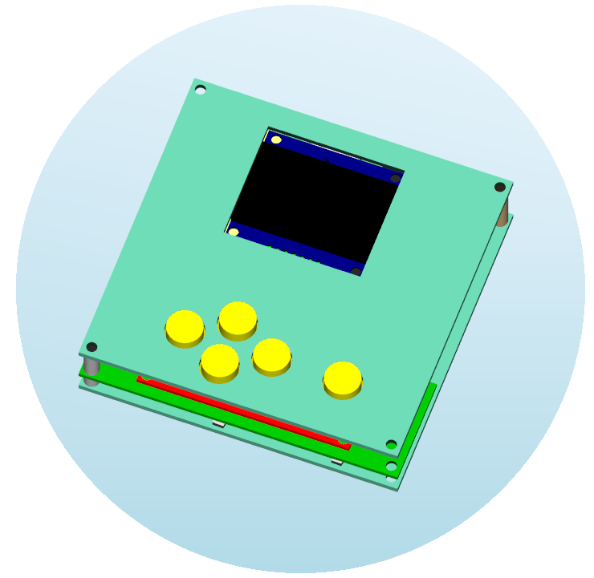

# Book In Pocket

ESP32 based book reader

  

## Parts: 
- DOIT Esp32 DevKit v1 (ESP-WROOM-32 DevKit v1)
- OLED Monochrome SPI 1.54" (128x64)
- SD card module 3.3V 
- Analog Keyboard module (5 keys)

## Case model:

  

